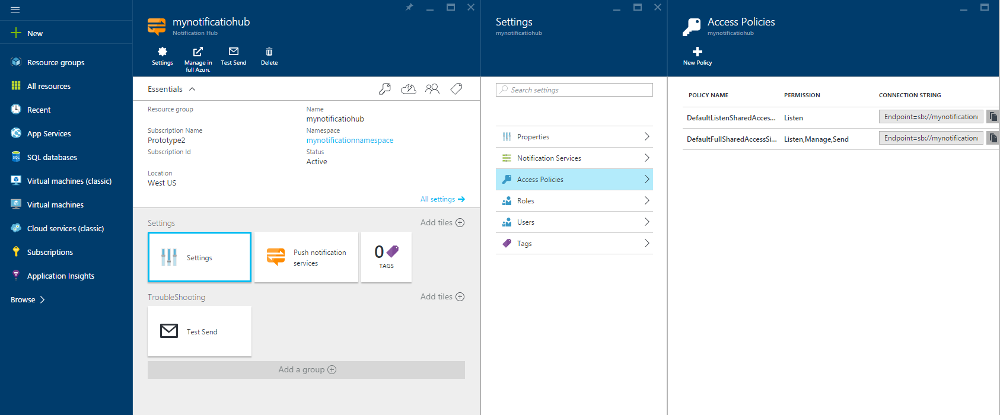
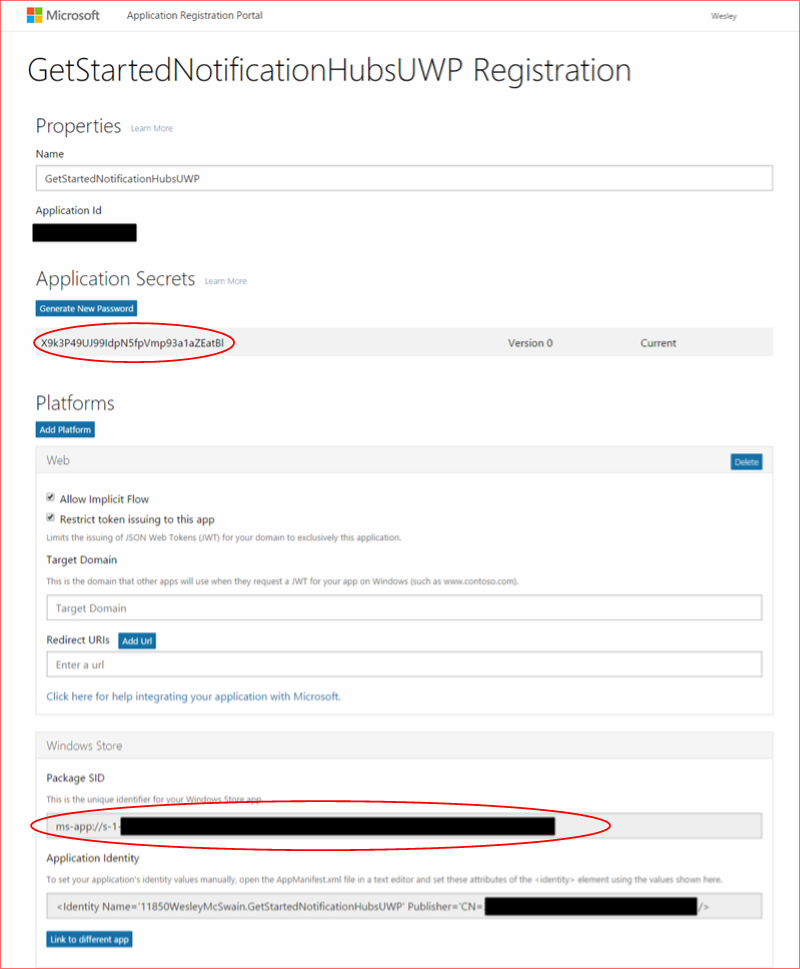
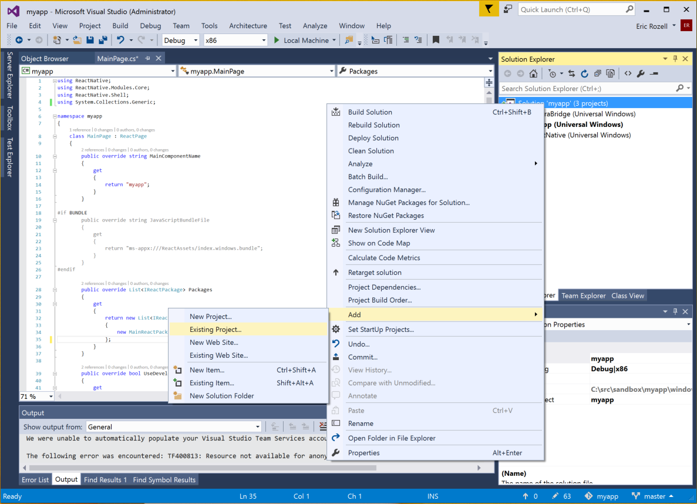

# React Native Azure Notification Hub

React Native module to support Azure Notification Hub push notifications on Android, iOS, and Windows.

# Installation

```
npm install react-native-azurenotificationhub
```

## Set up Azure Notification Hub

### Creating a new Notification Hub

* Log on to the [Azure Portal](https://portal.azure.com) and create a new **Notification Hub**.


* Take note of the two connection strings that are made available to you in **Settings > Access Policies**, as you will need them to handle push notifications later.



## Android Installation

### Register app with Notification Hub

* Log in to the [Firebase console](https://firebase.google.com/console/) and create a new Firebase project if you don't already have one.
* After your project is created click **Add Firebase to your Android app** and folow the instructions provided.

.

* In the Firebase Console, click the cog for your project and then click **Project Settings**


* Click the **Cloud Messaging** tab in your project settings and copy the value of the **Server key** and **Sender ID**. The former will be used to configure the Notification Hub Access Policy and and the latter for your React Native module registration.

* Back on the [Azure Portal](https://portal.azure.com) page for your notification hub, select **Settings > Notification Services > Google (GCM)**. Enter the FCM **Server key** you copied from the [Firebase console](https://firebase.google.com/console/) and click **Save**.


### Export React Native Module from app

Coming soon.

## Windows Installation

### Associate your app with the Windows Store

* Open your Visual Studio .sln (generally ./windows/[app name].sln) file in Visual Studio 2015.
* In Solution Explorer, right-click the Windows Store app project, click **Store**, and then click **Associate App with the Store...**


* Follow the instructions to login, reserve an app name, associate the app with the app name, and automatically configure the required Windows Store registration in the application manifest.

### Register app with Notification Hub

* On the [Windows Dev Center](https://dev.windows.com/overview) page for your new app, click **Services**, click **Push notifications**, and then click **Live Services site** under **Windows Push Notification Services (WNS) and Microsoft Azure Mobile Apps**.


* On the registration page for your app, make a note of the **Application Secret** password and the **Package security identifier** (SID) located in the Windows Store platform settings.



* Back on the [Azure Portal](https://portal.azure.com) page for your notification hub, select **Settings > Notification Services > Windows (WNS)**. Then enter the **Application Secret** password in the Security Key field. Enter your **Package SID** value that you obtained from WNS in the previous section, and then click **Save**.


### Export React Native Module from app

* In Solution Explorer of your open .sln in Visual Studio 2015, right-click the Solution, click **Add > Existing Project...**.



* Assuming you've already installed `react-native-azurenotificationhub` with NPM, find and select `ReactWindowsAzureNotificationHub.csproj` in `.\node_modules\react-native-azurenotificationhub\windows\ReactWindowsAzureNotificationHub`.
* Right-click the Windows Store app project, click ** Add > Reference**, and check `ReactWindowsAzureNotificationHub` from **Projects > Solution**.


* In **MainPage.cs** of your Windows Store app, add the the `ReactAzureNotificationHubPacakge` to your configured set of packages:

```c#
        public override List<IReactPackage> Packages
        {
            get
            {
                new List<IReactPackage>
                {
                    new MainReactPackage(),
                    new ReactAzureNotificationHubPackage(), // Also add using ReactWindowsAzureNotificationHub;
                }
            }
        }
```

* At this point you can register and unregister from the Azure Notification Hub instance using JavaScript as in the following example:

```js
const NotificationHub = require('react-native-azurenotificationhub');

class myapp extends Component {
  register() {
    NotificationHub.register({connectionString, hubName})
      .catch(reason => console.warn(reason));
  }

  unregister() {
    NotificationHub.unregister({connectionString, hubName})
      .catch(reason => console.warn(reason));
  }

  render() {
    return (
      <View style={styles.container}>
        <TouchableOpacity onPress={this.register.bind(this)}>
         <View style={styles.button}>
           <Text style={styles.buttonText}>
             Register
           </Text> 
         </View>
       </TouchableOpacity>
       <TouchableOpacity onPress={this.unregister.bind(this)}>
         <View style={styles.button}>
           <Text style={styles.buttonText}>
             Unregister
           </Text> 
         </View>
       </TouchableOpacity>
      </View>
    );
  }
```

## iOS Installation

Coming soon.
