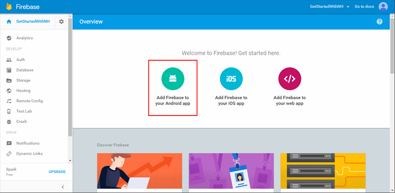
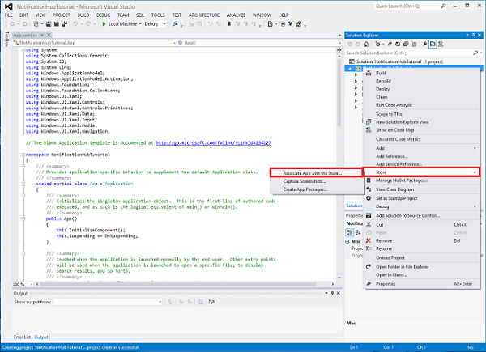
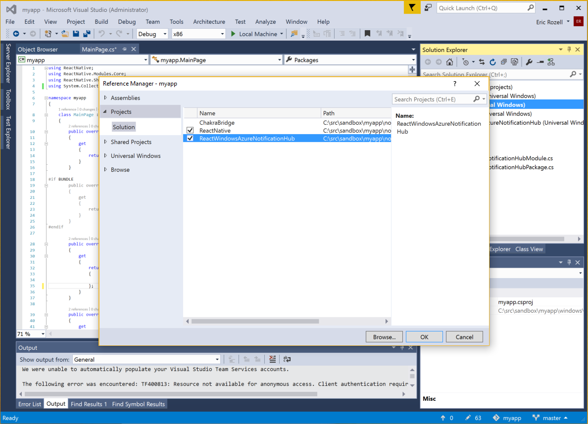

# React Native Azure Notification Hub

React Native module to support Azure Notification Hub push notifications on Android, iOS, and Windows.

# Quick Links

- [Getting Started](#getting-started)
  - [Create a Notification Hub](#create-a-notification-hub)
  - [Android Installation](#android-installation)
  - [Windows Installation](#windows-installation)
  - [iOS Installation](#ios-installation)
  - [JavaScript Configuration](#javascript-configuration)
  - [Publishing Notifications](#publishing-notifications)
- [License](#license)
- [Code of Conduct](#code-of-conduct)

# Prerequisites

## Android

The documentation that follows assumes you have generated a React Native Android project using the `react-native-cli`, i.e.:

```
react-native init myapp
```

In addition to the standard React Native requirements, you will also need to install the following Android SDK components with your prefered SDK management tools:
* Google Play services

## Windows

The documentation that follows assumes you have generated a React Native Windows project using the `react-native-cli` and `rnpm-plugin-windows`, i.e.:

```
react-native init myapp
cd myapp
npm i --save-dev rnpm-plugin-windows
react-native windows
```

It also assumes you have Visual Studio 2015 installed ([Visual Studio Community](https://www.visualstudio.com/en-us/products/visual-studio-community-vs.aspx) is fine).

## iOS

Coming soon.

# Getting Started

```
npm install react-native-azurenotificationhub
```

## Create a Notification Hub

* Log on to the [Azure Portal](https://portal.azure.com) and create a new **Notification Hub**.


## Android Installation

### Register app with Notification Hub

* Log in to the [Firebase console](https://firebase.google.com/console/) and create a new Firebase project if you don't already have one.
* After your project is created click **Add Firebase to your Android app** and folow the instructions provided.

.

* In the Firebase Console, click the cog for your project and then click **Project Settings**


* Click the **Cloud Messaging** tab in your project settings and copy the value of the **Server key** and **Sender ID**. The former will be used to configure the Notification Hub Access Policy and and the latter for your React Native module registration.

* Back on the [Azure Portal](https://portal.azure.com) page for your notification hub, select **Settings > Notification Services > Google (GCM)**. Enter the FCM **Server key** you copied from the [Firebase console](https://firebase.google.com/console/) and click **Save**.


### Export React Native Module from app

In `android/settings.gradle`

```gradle
...

include ':react-native-azurenotificationhub'
project(':react-native-azurenotificationhub').projectDir = file('../node_modules/react-native-azurenotificationhub/android')
```

In `android/app/build.gradle`

```gradle
...
dependencies {
    ...

    compile project(':react-native-azurenotificationhub')
    compile 'com.google.android.gms:play-services-gcm:9.4.0'
    compile 'com.google.firebase:firebase-messaging:9.4.0'
}
```

In `android/app/src/main/AndroidManifest.xml`

```xml
    ...
    
    <uses-permission android:name="android.permission.INTERNET"/>
    <uses-permission android:name="android.permission.GET_ACCOUNTS"/>
    <uses-permission android:name="com.google.android.c2dm.permission.RECEIVE" />
    
    <application ...>
      ...
      <service
        android:name="com.azure.reactnative.notificationhub.ReactNativeRegistrationIntentService"
        android:exported="false">
      </service>
      <receiver android:name="com.microsoft.windowsazure.notifications.NotificationsBroadcastReceiver"
        android:permission="com.google.android.c2dm.permission.SEND">
        <intent-filter>
          <action android:name="com.google.android.c2dm.intent.RECEIVE" />
        </intent-filter>
      </receiver>
    ...
```

Register the module package in `MainApplication.java`

```java
import com.azure.reactnative.notificationhub.ReactNativeNotificationHubPackage;

public class MainApplication extends Application implements ReactApplication {

  private final ReactNativeHost mReactNativeHost = new ReactNativeHost(this) {
    @Override
    protected boolean getUseDeveloperSupport() {
      return BuildConfig.DEBUG;
    }

    @Override
    protected List<ReactPackage> getPackages() {
      return Arrays.<ReactPackage>asList(
          new MainReactPackage(),
          new ReactNativeNotificationHubPackage() // <-- Add this package
      );
    }
  };

  ...
}
```

## Windows Installation

### Associate your app with the Windows Store

* Open your Visual Studio .sln (generally ./windows/[app name].sln) file in Visual Studio 2015.
* In Solution Explorer, right-click the Windows Store app project, click **Store**, and then click **Associate App with the Store...**



* Follow the instructions to login, reserve an app name, associate the app with the app name, and automatically configure the required Windows Store registration in the application manifest.

### Register app with Notification Hub

* On the [Windows Dev Center](https://dev.windows.com/overview) page for your new app, click **Services**, click **Push notifications**, and then click **Live Services site** under **Windows Push Notification Services (WNS) and Microsoft Azure Mobile Apps**.


* On the registration page for your app, make a note of the **Application Secret** password and the **Package security identifier** (SID) located in the Windows Store platform settings.


* Back on the [Azure Portal](https://portal.azure.com) page for your notification hub, select **Settings > Notification Services > Windows (WNS)**. Then enter the **Application Secret** password in the Security Key field. Enter your **Package SID** value that you obtained from WNS in the previous section, and then click **Save**.


### Export React Native Module from app

* In Solution Explorer of your open .sln in Visual Studio 2015, right-click the Solution, click **Add > Existing Project...**.


* Assuming you've already installed `react-native-azurenotificationhub` with NPM, find and select `ReactWindowsAzureNotificationHub.csproj` in `.\node_modules\react-native-azurenotificationhub\windows\ReactWindowsAzureNotificationHub`.
* Right-click the Windows Store app project, click ** Add > Reference**, and check `ReactWindowsAzureNotificationHub` from **Projects > Solution**.



* In **MainPage.cs** of your Windows Store app, add the the `ReactAzureNotificationHubPacakge` to your configured set of packages:

```c#
using ReactWindowsAzureNotificationHub;

namespace ...
{
    public class MainPage : ReactPage
    {
        ...
        
        public override List<IReactPackage> Packages
        {
            get
            {
                new List<IReactPackage>
                {
                    new MainReactPackage(),
                    new ReactAzureNotificationHubPackage(), // <-- Add this package
                }
            }
        }
        
        ...
    }
}
```

## iOS Installation

Coming soon.

## JavaScript Configuration

On the [Azure Portal](https://portal.azure.com) page for your notification hub, copy a connection string from **Settings > Access Policies**.


The example below shows how you can register and unregister from Azure Notification Hub in your React component.

```js
const NotificationHub = require('react-native-azurenotificationhub');

const connectionString = '...'; // The Notification Hub connection string
const hubName = '...';          // The Notification Hub name
const senderID = '...';         // The Sender ID from the Cloud Messaging tab of the Firebase console
const tags = [ ... ];           // The set of tags to subscribe to

class myapp extends Component {
  register() {
    NotificationHub.register({connectionString, hubName, senderID, tags})
      .catch(reason => console.warn(reason));
  }

  unregister() {
    NotificationHub.unregister()
      .catch(reason => console.warn(reason));
  }

  render() {
    return (
      <View style={styles.container}>
        <TouchableOpacity onPress={this.register.bind(this)}>
         <View style={styles.button}>
           <Text style={styles.buttonText}>
             Register
           </Text> 
         </View>
       </TouchableOpacity>
       <TouchableOpacity onPress={this.unregister.bind(this)}>
         <View style={styles.button}>
           <Text style={styles.buttonText}>
             Unregister
           </Text> 
         </View>
       </TouchableOpacity>
      </View>
    );
  }
```

## Publishing Notifications

Coming soon.

# License

The React Native Azure Notification Hub plugin is provided under the [MIT License](LICENSE).

# Code of Conduct

This project has adopted the [Microsoft Open Source Code of Conduct](https://opensource.microsoft.com/codeofconduct/). For more information see the [Code of Conduct FAQ](https://opensource.microsoft.com/codeofconduct/faq/) or contact [opencode@microsoft.com](mailto:opencode@microsoft.com) with any additional questions or comments.
