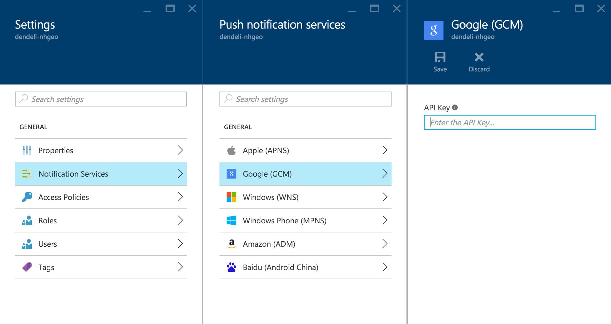

# Android Installation Guide

## Prerequisites

The documentation that follows assumes you have generated a React Native Android project using the `react-native-cli`, i.e.:

```
react-native init myapp
```

In addition to the standard React Native requirements, you will also need to install the following Android SDK components with your prefered SDK management tools:
* Google Play services

## Install react-native-azurenotificationhub

```
npm install react-native-azurenotificationhub
```

## Create a Notification Hub

* Log on to the [Azure Portal](https://portal.azure.com) and create a new **Notification Hub**.


## Register app with Notification Hub

* Log in to the [Firebase console](https://firebase.google.com/console/) and create a new Firebase project if you don't already have one.
* After your project is created click **Add Firebase to your Android app** and folow the instructions provided.

.

* In the Firebase Console, click the cog for your project and then click **Project Settings**


* Click the **Cloud Messaging** tab in your project settings and copy the value of the **Server key** and **Sender ID**. The former will be used to configure the Notification Hub Access Policy and and the latter for your React Native module registration.

* Back on the [Azure Portal](https://portal.azure.com) page for your notification hub, select **Settings > Notification Services > Google (GCM)**. Enter the FCM **Server key** you copied from the [Firebase console](https://firebase.google.com/console/) and click **Save**.



## Merging of icon resources

In `android/app/src/main/AndroidManifest.xml`

```xml  
    <application
      xmlns:tools="http://schemas.android.com/tools"
      tools:replace="android:icon,android:allowBackup"
      ...>
    </application>
```

This resolves the error caused by the manifest merger tool for gradle.

## Export React Native Module from app
In `android/build.gradle`

```gradle
...

buildscript {
	...
    dependencies {
        ...
        classpath("com.google.gms:google-services:4.2.0")
    }
}

```

In `android/app/build.gradle`

```gradle
...
dependencies {
    ...

    implementation project(":react-native-azurenotificationhub") // <- Note only include this line if using a version of RN < 0.60 since it will be auto linked
    implementation "com.google.firebase:firebase-messaging:17.6.0"
    implementation "com.google.firebase:firebase-core:16.0.8"
}

apply plugin: "com.google.gms.google-services"

```

In `android/app/src/main/AndroidManifest.xml`

```xml
    ...
    
    <uses-permission android:name="android.permission.INTERNET"/>
    
    <application ...>
      ...
        <uses-library
            android:name="org.apache.http.legacy"
            android:required="false" />

        <service
            android:name="com.azure.reactnative.notificationhub.ReactNativeRegistrationIntentService"
            android:exported="false" />

        <service
            android:name="com.azure.reactnative.notificationhub.ReactNativeFirebaseMessagingService"
            android:stopWithTask="false">
            <intent-filter>
                <action android:name="com.google.firebase.MESSAGING_EVENT" />
            </intent-filter>
        </service>

        <receiver
            android:name="com.microsoft.windowsazure.notifications.NotificationsBroadcastReceiver"
            android:permission="com.google.android.c2dm.permission.SEND">
            <intent-filter>
                <action android:name="com.google.android.c2dm.intent.RECEIVE" />
            </intent-filter>
        </receiver>
    ...
```

## If using a version of React Native before [RN 0.60](https://github.com/facebook/react-native/releases/tag/v0.60.0) that does not support autolinking:

In `android/settings.gradle`

```gradle
...

include ':react-native-azurenotificationhub'
project(':react-native-azurenotificationhub').projectDir = file('../node_modules/react-native-azurenotificationhub/android')
```

Register the module package in `MainApplication.java`

```java
import com.azure.reactnative.notificationhub.ReactNativeNotificationHubPackage;

public class MainApplication extends Application implements ReactApplication {

  private final ReactNativeHost mReactNativeHost = new ReactNativeHost(this) {
    @Override
    protected boolean getUseDeveloperSupport() {
      return BuildConfig.DEBUG;
    }

    @Override
    protected List<ReactPackage> getPackages() {
      return Arrays.<ReactPackage>asList(
          new MainReactPackage(),
          new ReactNativeNotificationHubPackage() // <-- Add this package
      );
    }
  };

  ...
}
```

## JavaScript Configuration

On the [Azure Portal](https://portal.azure.com) page for your notification hub, copy a connection string from **Settings > Access Policies**.


The example below shows how you can register and unregister from Azure Notification Hub in your React component.

```js
const NotificationHub = require('react-native-azurenotificationhub');
const PushNotificationEmitter = new NativeEventEmitter(NotificationHub);

const NOTIF_REGISTER_AZURE_HUB_EVENT = 'azureNotificationHubRegistered';
const NOTIF_AZURE_HUB_REGISTRATION_ERROR_EVENT = 'azureNotificationHubRegistrationError';
const DEVICE_NOTIF_EVENT = 'remoteNotificationReceived';

const connectionString = '...'; // The Notification Hub connection string
const hubName = '...';          // The Notification Hub name
const senderID = '...';         // The Sender ID from the Cloud Messaging tab of the Firebase console
const tags = [ ... ];           // The set of tags to subscribe to

class myapp extends Component {
  constructor(props) {
    super(props);
    PushNotificationEmitter.addListener(DEVICE_NOTIF_EVENT, this._onRemoteNotification);
  }

  register() {
    PushNotificationEmitter.addListener(NOTIF_REGISTER_AZURE_HUB_EVENT, this._onAzureNotificationHubRegistered);
    PushNotificationEmitter.addListener(NOTIF_AZURE_HUB_REGISTRATION_ERROR_EVENT, this._onAzureNotificationHubRegistrationError);
  
    NotificationHub.register({connectionString, hubName, senderID, tags})
      .catch(reason => console.warn(reason));
  }

  unregister() {
    NotificationHub.unregister()
      .catch(reason => console.warn(reason));
  }

  render() {
    return (
      <View style={styles.container}>
        <TouchableOpacity onPress={this.register.bind(this)}>
         <View style={styles.button}>
           <Text style={styles.buttonText}>
             Register
           </Text> 
         </View>
       </TouchableOpacity>
       <TouchableOpacity onPress={this.unregister.bind(this)}>
         <View style={styles.button}>
           <Text style={styles.buttonText}>
             Unregister
           </Text> 
         </View>
       </TouchableOpacity>
      </View>
    );
  }
  
  _onAzureNotificationHubRegistered(registrationID) {
    console.warn('RegistrationID: ' + registrationID);
  }
  
  _onAzureNotificationHubRegistrationError(error) {
    console.warn('Error: ' + error);
  }
  
  _onRemoteNotification(notification) {
    // Note notification will be a JSON string for android
    console.warn('Notification received: ' + notification);
  }  
```
