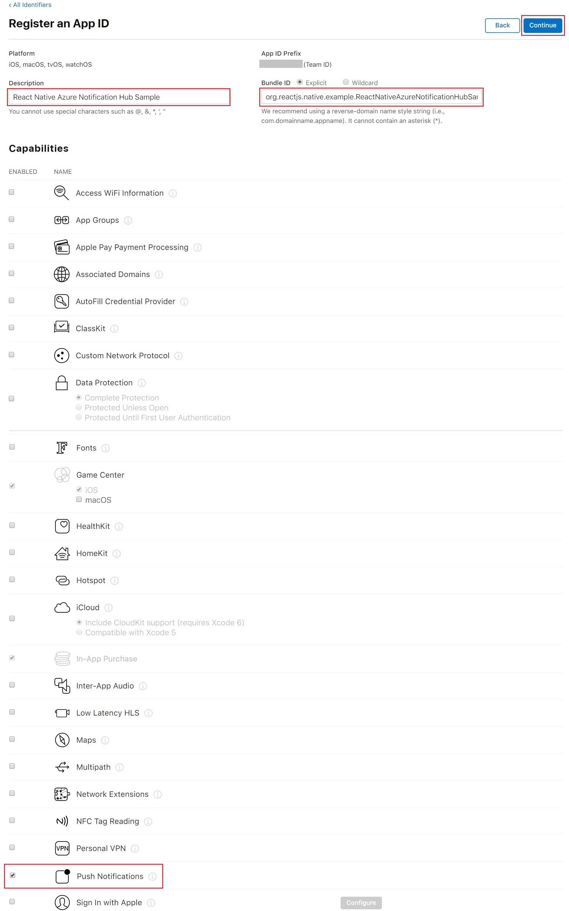
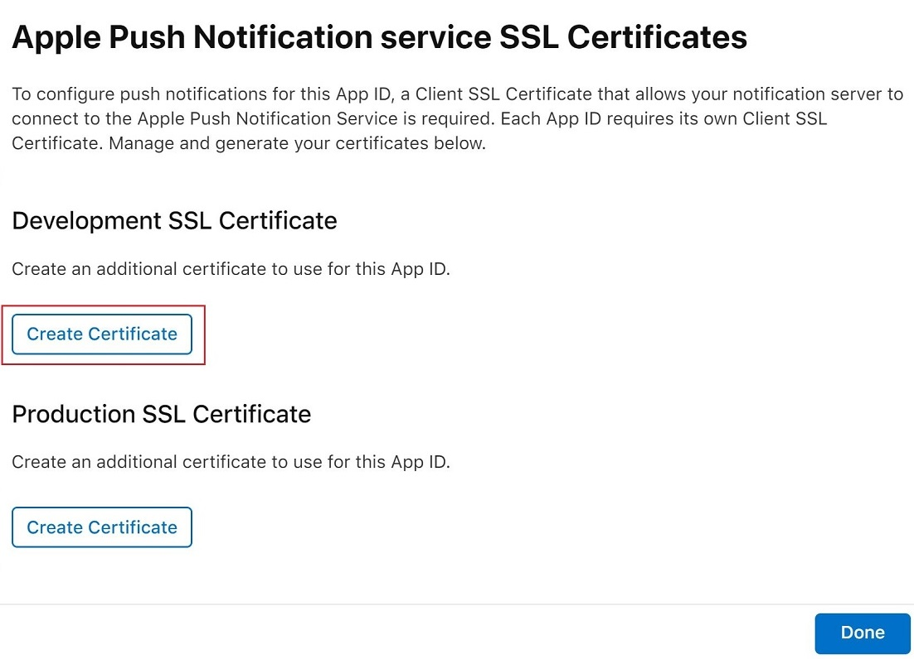
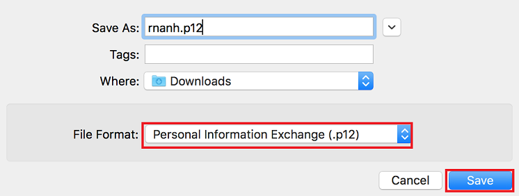
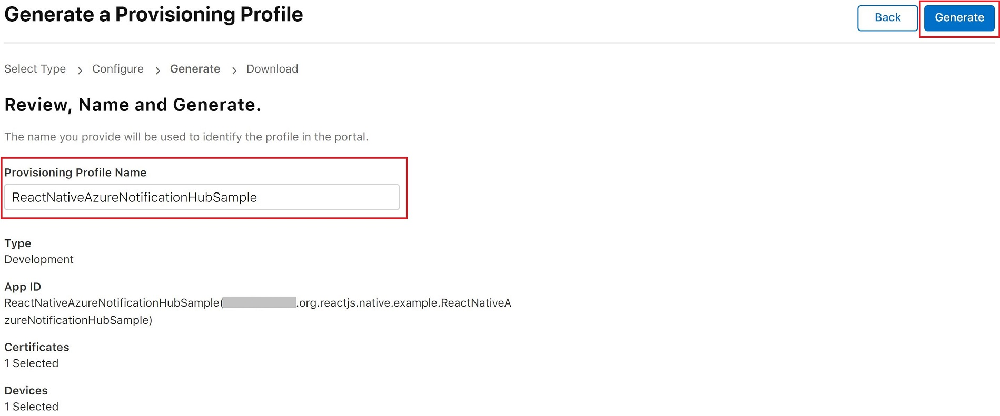
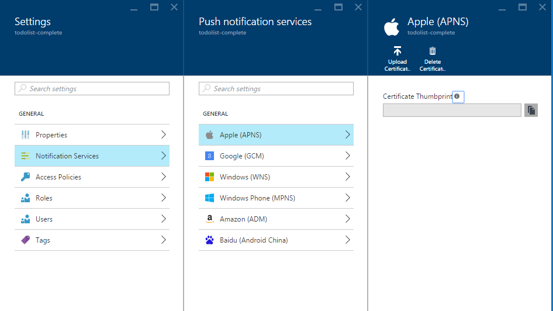
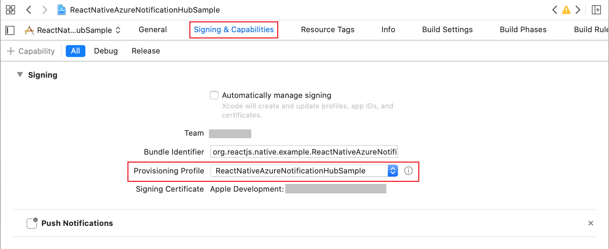
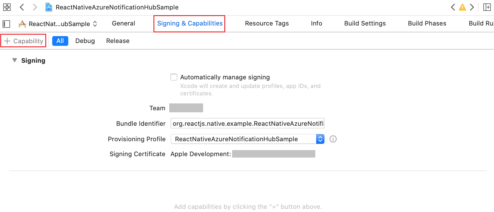
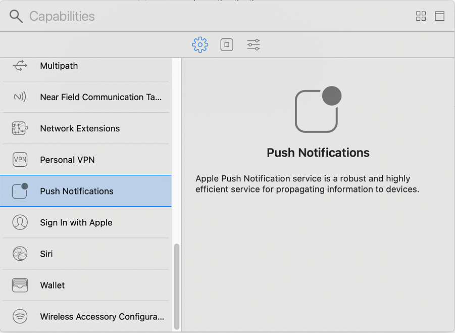

# iOS Installation Guide

## Prerequisites

The documentation that follows assumes you have generated a React Native iOS project using the `react-native-cli`, i.e.:

```
react-native init ReactNativeAzureNotificationHubSample
```

In addition to the standard React Native requirements, you will also need the following:
* An iOS 9 (or later version)-capable device (simulator doesn't work with push notifications)
* [Apple Developer Program](https://developer.apple.com/programs/) membership

## Install react-native-azurenotificationhub

Install the library using either **Yarn**:

    yarn add react-native-azurenotificationhub

or npm:

    npm install --save react-native-azurenotificationhub

Add the following line to your `ios/Podfile` file and run **pod install**
    
    pod 'RNAzureNotificationHub', :podspec => '../node_modules/react-native-azurenotificationhub/RNAzureNotificationHub.podspec'

## Create a Notification Hub

* Log on to the [Azure Portal](https://portal.azure.com) and create a new **Notification Hub**.


## Generate the Certificate Signing Request file

* On your Mac, run the Keychain Access tool. It can be opened from the **Utilities** folder or the **Other** folder on the launch pad.

* Click **Keychain Access**, expand **Certificate Assistant**, then click **Request a Certificate from a Certificate Authority...**.

  	

* Select your **User Email Address** and **Common Name** , make sure that **Saved to disk** is selected, and then click **Continue**. Leave the **CA Email Address** field blank as it is not required.

  	

* Type a name for the Certificate Signing Request (CSR) file in **Save As**, select the location in **Where**, then click **Save**.

  	

## Register your app for push notifications

* If you have not already registered your app, navigate to the [iOS Provisioning Portal](http://go.microsoft.com/fwlink/p/?LinkId=272456) at the Apple Developer Center, log on with your Apple ID, click **Identifiers**, then click **App IDs**, and finally click on the **+** sign to register a new app.


* Update the following three fields for your new app and then click **Continue**:

  * **Description**: Type a description for your app.

  * **Bundle ID**: Enter a Bundle Identifier in the form `<Organization Identifier>.<Product Name>` as mentioned in the [App Distribution Guide](https://developer.apple.com/library/mac/documentation/IDEs/Conceptual/AppDistributionGuide/ConfiguringYourApp/ConfiguringYourApp.html#//apple_ref/doc/uid/TP40012582-CH28-SW8). The *Organization Identifier* and *Product Name* you use must match the organization identifier and product name you will use when you create your XCode project. In the screenshot below, *org.reactjs.native.example* is used as the organization identifier and *ReactNativeAzureNotificationHubSample* is used as the product name. Making sure this matches the values you will use in your XCode project will allow you to use the correct publishing profile with XCode.

  * **Push Notifications**: Check the **Push Notifications** option in the **Capabilities** section.



* This generates your App ID and requests you to confirm the information. Click **Register** to confirm the new App ID.


* In the Developer Center, under App IDs, locate the app ID that you just created, and click on its row.


* Scroll to the bottom of the screen, and click the **Configure** button next to **Push Notifications**.


* Click the **Create Certificate** button.



* Browse to the location where you saved the CSR file that you created in the first task, then click **Continue**.


* Click the **Download** button to download the certificate.


* Double-click the downloaded push certificate **aps_development.cer**.


* In Keychain Access, right-click on the certificate, click **Export**, name the file, select the **.p12** format, and then click **Save**.



## Create a provisioning profile for the app

* Back in the <a href="http://go.microsoft.com/fwlink/p/?LinkId=272456" target="_blank">iOS Provisioning Portal</a>, select **Profiles** and then click the **+** button to create a new profile.


* Select **iOS App Development** under **Development** as the provision profile type, and click **Continue**.


* Next, select the app ID you just created from the **App ID** drop-down list, and click **Continue**.


* Under **Select certificates** section, select your usual development certificate used for code signing, and click **Continue**. This is not the push certificate you just created.


* Next, select the **Devices** to use for testing, and click **Continue**


* Finally, pick a name for the profile and click **Generate**.



* Click the **Download** button to download the new profile. After that, you can double-click on the file to import it to XCode.


## Configure your Notification Hub for iOS push notifications

* Back on the [Azure Portal](https://portal.azure.com) page for your notification hub, select **Settings > Notification Services > Apple (APNS)**. Click on **Upload Certificate** and select the **.p12** file that you exported earlier. Make sure you also specify the correct password.

* Make sure to select **Sandbox** mode since this is for development. Only use the **Production** if you want to send push notifications to users who purchased your app from the store.



## Connect your iOS app to Notification Hubs

* Make sure to use the same **Product Name** and **Organization Identifier** that you used when you previously set the bundle ID on the Apple Developer portal, i.e.:

  * Product Name: *ReactNativeAzureNotificationHubSample*
  * Organization Identifier: *org.reactjs.native.example*

* Remember to set **Provisioning Profile** to the provisioning profile that you created previously.



* To enable support for notification and register events you need to augment your AppDelegate. At the top of your **AppDelegate.m**:

```objective-c
#import <RNAzureNotificationHub/RCTAzureNotificationHubManager.h>
```

* And then add the following code in the same file:

```objective-c
// Required to register for notifications
- (void)application:(UIApplication *)application didRegisterUserNotificationSettings:(UIUserNotificationSettings *)notificationSettings
{
    [RCTAzureNotificationHubManager didRegisterUserNotificationSettings:notificationSettings];
}

// Required for the register event.
- (void)application:(UIApplication *)application didRegisterForRemoteNotificationsWithDeviceToken:(NSData *)deviceToken
{
    [RCTAzureNotificationHubManager didRegisterForRemoteNotificationsWithDeviceToken:deviceToken];
}

// Required for the registrationError event.
- (void)application:(UIApplication *)application didFailToRegisterForRemoteNotificationsWithError:(NSError *)error
{
    [RCTAzureNotificationHubManager didFailToRegisterForRemoteNotificationsWithError:error];
}

// Required for the notification event.
- (void)application:(UIApplication *)application didReceiveRemoteNotification:(NSDictionary *)notification
{
    [RCTAzureNotificationHubManager didReceiveRemoteNotification:notification];
}

// Required for the localNotification event.
- (void)application:(UIApplication *)application didReceiveLocalNotification:(UILocalNotification *)notification
{
    [RCTAzureNotificationHubManager didReceiveLocalNotification:notification];
}
```

## Enable Push Notifications capability

In the project setting, select **Signing & Capabilities** and click **+** to add a capability:



Double-click on **Push Notifications** to add it:



Notice that **Push Notifications** capability has been added:


## JavaScript Configuration

On the [Azure Portal](https://portal.azure.com) page for your notification hub, copy a connection string from **Settings > Access Policies**.


The example below shows how you can register and unregister from Azure Notification Hub in your React component.

```js
import React, { Component } from 'react';
import {
  Alert,
  StyleSheet,
  Text,
  TouchableOpacity,
  View,
} from 'react-native';

const NotificationHub = require('react-native-azurenotificationhub/index.ios');

const connectionString = '...'; // The Notification Hub connection string
const hubName = '...';          // The Notification Hub name
const tags = [ ... ];           // The set of tags to subscribe to

let remoteNotificationsDeviceToken = '';  // The device token registered with APNS

export default class App extends Component {
  requestPermissions() {
    // register: Fired when the user registers for remote notifications. The
    // handler will be invoked with a hex string representing the deviceToken.
    NotificationHub.addEventListener('register', this._onRegistered);

    // registrationError: Fired when the user fails to register for remote
    // notifications. Typically occurs when APNS is having issues, or the device
    // is a simulator. The handler will be invoked with {message: string, code: number, details: any}.
    NotificationHub.addEventListener('registrationError', this._onRegistrationError);

    // registerAzureNotificationHub: Fired when registration with azure notification hubs successful
    // with object {success: true}
    NotificationHub.addEventListener('registerAzureNotificationHub', this._onAzureNotificationHubRegistered);

    // azureNotificationHubRegistrationError: Fired when registration with azure notification hubs
    // fails with object {message: string, details: any} 
    NotificationHub.addEventListener('azureNotificationHubRegistrationError', this._onAzureNotificationHubRegistrationError);

    // notification: Fired when a remote notification is received. The
    // handler will be invoked with an instance of `AzureNotificationHubIOS`.
    NotificationHub.addEventListener('notification', this._onRemoteNotification);

    // localNotification: Fired when a local notification is received. The
    // handler will be invoked with an instance of `AzureNotificationHubIOS`.
    NotificationHub.addEventListener('localNotification', this._onLocalNotification);

    // Requests notification permissions from iOS, prompting the user's
    // dialog box. By default, it will request all notification permissions, but
    // a subset of these can be requested by passing a map of requested
    // permissions.
    // The following permissions are supported:
    //  - `alert`
    //  - `badge`
    //  - `sound`
    //
    // returns a promise that will resolve when the user accepts,
    // rejects, or if the permissions were previously rejected. The promise
    // resolves to the current state of the permission of 
    // {alert: boolean, badge: boolean,sound: boolean }
    NotificationHub.requestPermissions();
  }

  register() {
    NotificationHub.register(remoteNotificationsDeviceToken, {connectionString, hubName, tags});
  }

  unregister() {
    NotificationHub.unregister();
  }

  render() {
    return (
      <View style={styles.container}>
        <TouchableOpacity onPress={this.requestPermissions.bind(this)}>
         <View style={styles.button}>
           <Text style={styles.buttonText}>
             Request permission
           </Text> 
         </View>
       </TouchableOpacity>
       <TouchableOpacity onPress={this.register.bind(this)}>
         <View style={styles.button}>
           <Text style={styles.buttonText}>
             Register
           </Text> 
         </View>
       </TouchableOpacity>
       <TouchableOpacity onPress={this.unregister.bind(this)}>
         <View style={styles.button}>
           <Text style={styles.buttonText}>
             Unregister
           </Text> 
         </View>
       </TouchableOpacity>
      </View>
    );
  }

  _onRegistered(deviceToken) {
    remoteNotificationsDeviceToken = deviceToken;
    Alert.alert(
      'Registered For Remote Push',
      `Device Token: ${deviceToken}`,
      [{
        text: 'Dismiss',
        onPress: null,
      }]
    );
  }

  _onRegistrationError(error) {
    Alert.alert(
      'Failed To Register For Remote Push',
      `Error (${error.code}): ${error.message}`,
      [{
        text: 'Dismiss',
        onPress: null,
      }]
    );
  }

  _onRemoteNotification(notification) {
    Alert.alert(
      'Push Notification Received',
      'Alert message: ' + notification.getMessage(),
      [{
        text: 'Dismiss',
        onPress: null,
      }]
    );
  }

  _onAzureNotificationHubRegistered(registrationInfo) {
    Alert.alert('Registered For Azure notification hub',
      'Registered For Azure notification hub'
      [{
        text: 'Dismiss',
        onPress: null,
      }]
    );
  }

  _onAzureNotificationHubRegistrationError(error) {
    Alert.alert(
      'Failed To Register For Azure Notification Hub',
      `Error (${error.code}): ${error.message}`,
      [{
        text: 'Dismiss',
        onPress: null,
      }]
    );
  }

  _onLocalNotification(notification){
    // Note notification will be object for iOS
    Alert.alert(
      'Local Notification Received',
      'Alert message: ' + notification.getMessage(),
      [{
        text: 'Dismiss',
        onPress: null,
      }]
    );
  }
}

const styles = StyleSheet.create({
  container: {
    flex: 1,
    justifyContent: 'center',
    alignItems: 'center',
    backgroundColor: '#F5FCFF',
  },
  welcome: {
    fontSize: 20,
    textAlign: 'center',
    margin: 10,
  },
  instructions: {
    textAlign: 'center',
    color: '#333333',
    marginBottom: 5,
  },
});
```
